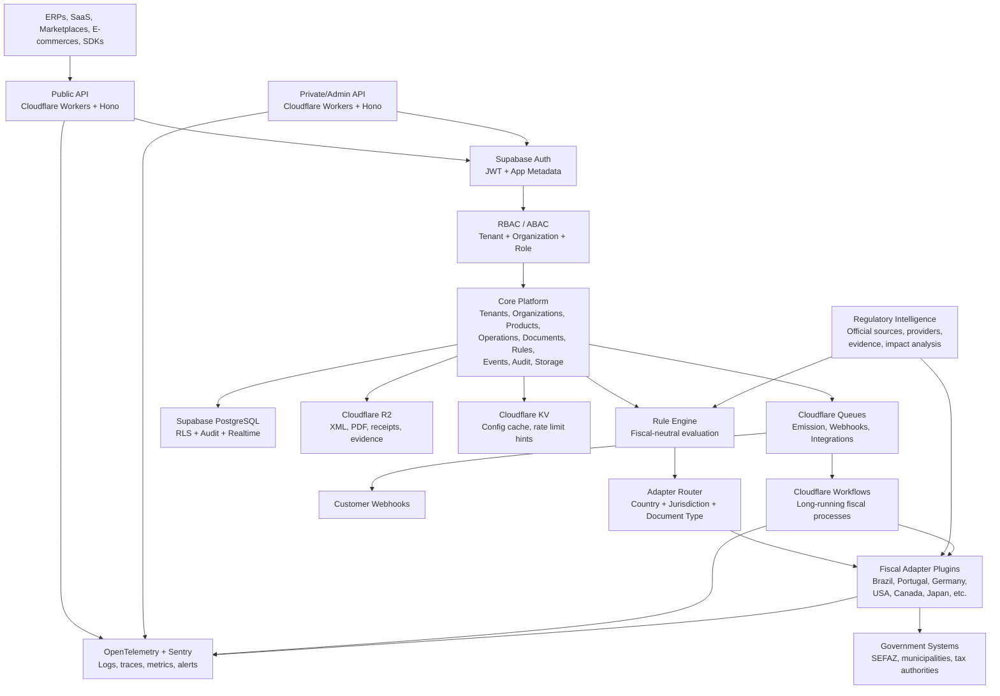
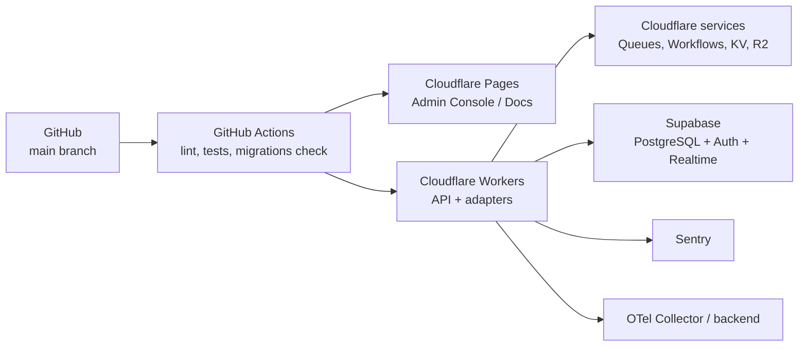
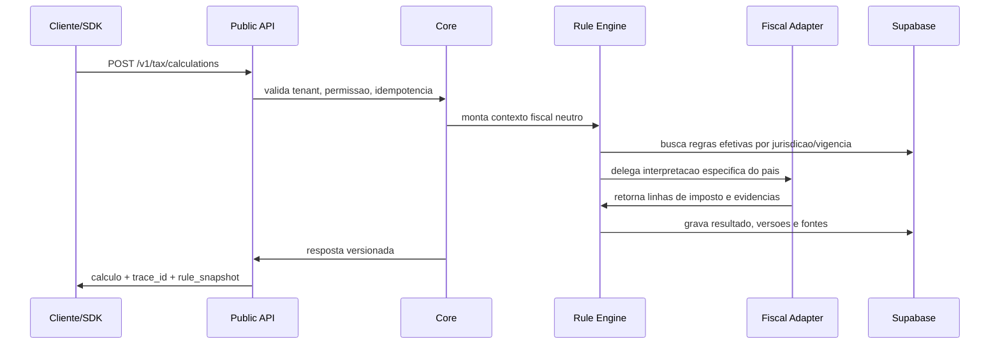
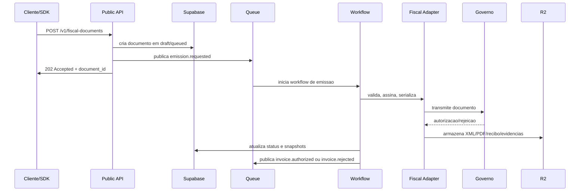

# Arquitetura de alto nivel

## Objetivo

Helvok Tax e uma infraestrutura global de compliance tributario. Ela fornece uma API unica para softwares, SaaS, ERPs, marketplaces, CRMs e e-commerces calcularem tributos, emitirem documentos fiscais, comunicarem-se com governos e auditarem operacoes em varios paises.

O Brasil e o primeiro adaptador fiscal, nao o centro da arquitetura.

## Nao objetivos

- Nao e ERP.
- Nao e CMS.
- Nao e emissor fiscal isolado.
- Nao e motor tributario monolitico.
- Nao deve conter legislacao hardcoded no Core.

## Principios arquiteturais

1. Core global e fiscalmente neutro.
2. Legislacao desacoplada por dados, versoes e adaptadores.
3. Adaptadores fiscais por pais, com contratos estaveis.
4. Toda emissao assincrona via filas e workflows.
5. Toda decisao fiscal rastreavel por regra, versao, fonte legal e vigencia.
6. Multi-tenancy por desenho, nao por convencao posterior.
7. Seguranca, auditoria e observabilidade desde a primeira migration.
8. APIs publicas versionadas, idempotentes e com rate limit.
9. IA separada de decisao fiscal homologada.
10. Cada fase deve ser funcional, revisavel e pronta para producao.

## Topologia logica

## Camadas

### Edge/API

- Workers com Hono para APIs publicas e privadas.
- API versionada: `/v1`.
- Idempotencia obrigatoria em operacoes mutaveis.
- Rate limit por tenant, app, chave de API e endpoint.
- Validacao de payload antes de tocar no dominio.

### Core

Responsavel por conceitos globais:

- tenants
- organizacoes
- usuarios e membros
- permissoes
- catalogo global
- clientes/partes
- operacoes comerciais
- documentos fiscais abstratos
- regras fiscais abstratas
- eventos
- workflows
- auditoria
- storage
- observabilidade
- SDK
- marketplace de plugins

O Core nao possui classes, colunas ou enums especificos de um tributo nacional.

### Fiscal Adapter Layer

Responsavel por conhecer:

- documentos fiscais locais
- tributos locais
- autoridades governamentais
- formatos XML, JSON, PDF e QR Code
- assinaturas digitais
- protocolos de comunicacao
- rejeicoes e retornos
- obrigacoes acessorias
- guias e declaracoes

Cada adaptador implementa um contrato padrao e pode possuir tabelas proprias em schema isolado.

### Data Layer

- Supabase PostgreSQL como fonte relacional.
- RLS obrigatorio nas tabelas expostas.
- Schemas separados por responsabilidade.
- Views com `security_invoker` quando forem expostas.
- R2 para documentos fiscais, artefatos assinados e evidencias.
- KV para caches efemeros e configuracoes de borda.

### Async Layer

- Emissoes, transmissao governamental, webhooks e integracoes passam por filas.
- Workflows orquestram etapas longas, retentativas, backoff e compensacoes.
- Nenhuma emissao deve depender da sessao HTTP do usuario.

## Topologia de deploy

## Modulos principais

| Modulo | Responsabilidade | Fase inicial |
| --- | --- | --- |
| Identity | Auth, usuarios, membros, app metadata | Fase 2 |
| Tenancy | tenants, ambientes, isolamento | Fase 2 |
| Organizations | grupos, empresas, filiais, estabelecimentos | Fase 2 |
| Catalog | produtos, servicos, classificacoes globais | Fase 3 |
| Parties | clientes, fornecedores, enderecos, IDs fiscais | Fase 3 |
| Commerce | pedidos, itens, operacoes, moedas | Fase 3 |
| Tax Rules | regras, versoes, vigencias, fontes legais | Fase 4 |
| Tax Calculation | simulacoes e calculo fiscal | Fase 4 |
| Fiscal Documents | ciclo de vida abstrato de documentos | Fase 5 |
| Brazil Adapter | NF-e inicial e homologacao | Fase 5 |
| Regulatory Intelligence | fontes oficiais, provedores, evidencias, impacto e homologacao | Fase 4+ |
| Audit | trilha imutavel e eventos de dominio | Fase 1 |
| Integrations | webhooks, API keys, conectores | Fases 7-8 |
| AI Assist | explicacoes e inconsistencias, sem decidir imposto | Fase posterior |

## Fluxo de calculo tributario

## Fluxo de emissao fiscal

## Boundaries do Core

O Core pode:

- escolher adaptador por pais, jurisdicao e tipo de documento;
- validar permissao e ownership;
- persistir estado e auditoria;
- garantir idempotencia;
- controlar lifecycle de documentos;
- orquestrar workflows;
- expor eventos e webhooks.

O Core nao pode:

- calcular ICMS, VAT, Sales Tax ou qualquer imposto especifico;
- conhecer campos fiscais nacionais como CFOP, NCM, CST, CNPJ, EIN, VAT ID como regra de negocio central;
- serializar XML fiscal local;
- decidir protocolo governamental;
- sobrescrever regras sem versao.

## Regulatory Intelligence

Helvok Tax pode consultar governos, bases oficiais e provedores externos, mas essas fontes entram como evidencias controladas. Mudancas criticas passam por analise de impacto, revisao profissional, testes de regressao e publicacao de nova versao antes de afetar producao.

Obrigacoes e transmissoes devem declarar se suportam automacao integral, automacao assistida ou apenas orientacao operacional. Isso impede que o produto prometa transmissao automatica onde a autoridade, o provedor ou a lei exige operador habilitado, certificado, representante local ou submissao externa.

## Ambiente e dominios

O dominio provisório informado para testes diretos na plataforma e:

`helvokglobaltax.genialidadefilosofica.workers.dev`

Durante fases implementaveis, validacoes devem preferir deploys Cloudflare e checks remotos. Localhost e portas locais nao sao o fluxo principal de validacao deste projeto.
