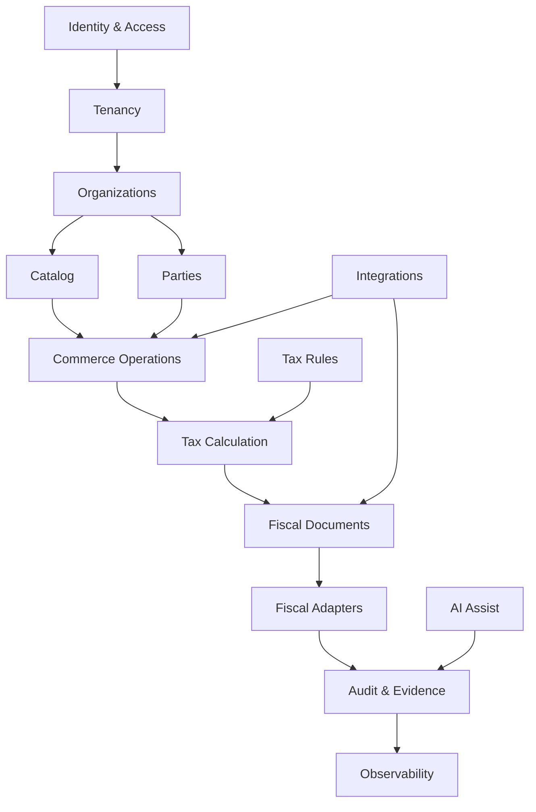
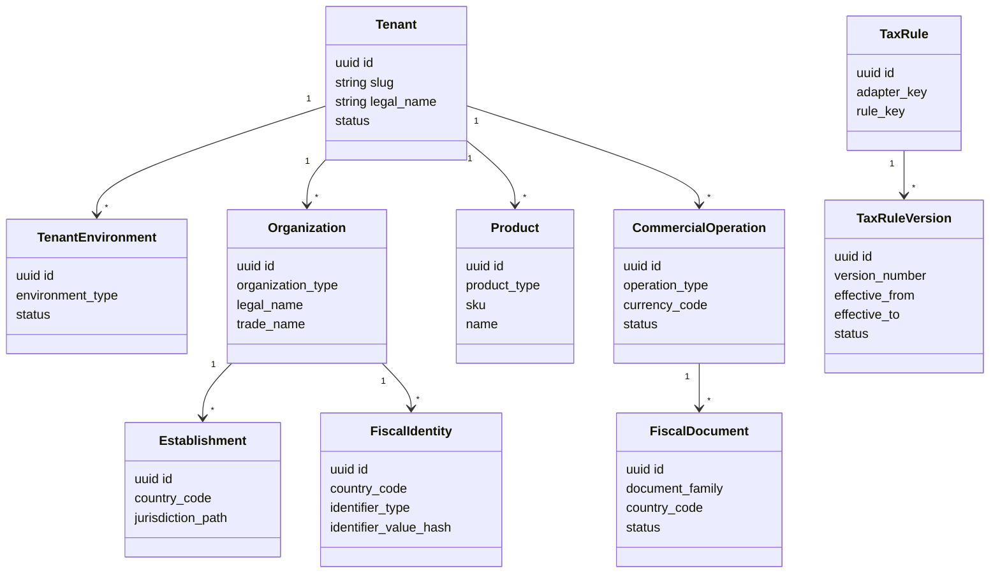

# Modelo de dominio

## Estilo

O dominio sera organizado por DDD com bounded contexts. Cada contexto possui aggregate roots, invariantes, eventos e contratos. A persistencia relacional nao deve vazar para o modelo de dominio.

## Bounded contexts

## Contextos e aggregates

### Identity & Access

Aggregate roots:

- UserProfile
- Membership
- Role
- PermissionSet
- ApiCredential

Invariantes:

- Um usuario so atua em um tenant se possuir membership ativo.
- Permissoes efetivas sao derivadas de role, escopo e ambiente.
- Dados autorizativos ficam em app metadata ou tabelas internas, nunca em user metadata editavel.

Eventos:

- user.invited
- user.joined
- membership.updated
- api_key.created
- api_key.revoked

### Tenancy

Aggregate roots:

- Tenant
- TenantEnvironment
- TenantPlan
- TenantSetting

Invariantes:

- Todo dado operacional pertence a um tenant.
- Cada tenant possui pelo menos um ambiente: sandbox ou production.
- Ambiente controla credenciais, certificados, chaves, rate limits e webhooks.

Eventos:

- tenant.created
- tenant.environment.created
- tenant.suspended
- tenant.reactivated

### Organizations

Aggregate roots:

- Organization
- Establishment
- FiscalIdentity
- Certificate

Invariantes:

- Uma organizacao pertence a um tenant.
- Uma organizacao pode representar empresa, filial, holding, subsidiaria ou representacao.
- FiscalIdentity e especifica por pais, tipo e vigencia.
- Certificados nunca ficam no banco em texto puro.

Eventos:

- organization.created
- establishment.created
- fiscal_identity.added
- certificate.uploaded
- certificate.expired

### Catalog

Aggregate roots:

- Product
- Service
- CatalogClassification
- PriceProfile

Invariantes:

- O catalogo e global, mas classificacoes fiscais sao resolvidas por adaptador.
- Produto ou servico pode existir em varios paises, moedas e idiomas.
- A classificacao local deve ser versionada quando afetar tributacao.

Eventos:

- product.created
- product.updated
- service.created
- classification.updated

### Parties

Aggregate roots:

- Party
- PartyFiscalIdentity
- Address
- Contact

Invariantes:

- Party representa cliente, fornecedor, marketplace, intermediador ou autoridade.
- IDs fiscais sao tipados por pais e por vigencia.
- Enderecos possuem jurisdicao normalizada para calculo fiscal.

Eventos:

- party.created
- party.fiscal_identity.added
- party.address.updated

### Commerce Operations

Aggregate roots:

- CommercialOperation
- Order
- OrderItem
- PaymentReference
- ShipmentReference

Invariantes:

- Operacao comercial possui tenant, ambiente, organizacao emissora, partes, itens, moeda e pais de origem/destino.
- Itens podem representar mercadorias, servicos, assinaturas, downloads, kits, marketplace, SaaS, licencas, ativos, alugueis, hospedagem, eventos, turismo e outros.
- Uma operacao pode gerar zero, um ou varios documentos fiscais.

Eventos:

- operation.created
- operation.updated
- order.created
- order.confirmed
- tax.calculation.requested

### Tax Rules

Aggregate roots:

- RuleSet
- TaxRule
- TaxRuleVersion
- LegalSource
- Jurisdiction
- Regime
- Benefit

Invariantes:

- TaxRule nunca e sobrescrita.
- Toda mudanca cria TaxRuleVersion.
- Versoes possuem vigencia, prioridade, status, autor, revisor e fonte legal.
- Uma regra so entra em producao com status aprovado/publicado.

Eventos:

- rule.created
- rule.version.created
- rule.reviewed
- rule.published
- rule.retired
- rule.updated

### Tax Calculation

Aggregate roots:

- TaxCalculation
- TaxCalculationLine
- TaxEvidenceSnapshot

Invariantes:

- Todo calculo guarda snapshot das regras utilizadas.
- O resultado deve ser reproduzivel mesmo se novas regras forem publicadas.
- Simulacoes e calculos definitivos sao separados por finalidade.

Eventos:

- tax.calculated
- tax.calculation.failed
- tax.simulation.created

### Fiscal Documents

Aggregate roots:

- FiscalDocument
- FiscalDocumentAttempt
- FiscalArtifact
- GovernmentReceipt

Invariantes:

- Documento fiscal possui ciclo de vida explicito.
- Emissao/transmissao e assincrona.
- Artefatos fiscais ficam em R2 com metadados e hash no banco.
- Rejeicoes nunca apagam tentativas anteriores.

Eventos:

- invoice.created
- invoice.queued
- invoice.authorized
- invoice.rejected
- invoice.cancelled
- document.artifact.stored

### Fiscal Adapters

Aggregate roots:

- AdapterManifest
- AdapterVersion
- AdapterCapability
- AdapterExecution

Invariantes:

- Cada adaptador declara paises, jurisdicoes, documentos, tributos e capacidades.
- O Core chama adaptadores por contrato, nao por detalhes locais.
- Adaptadores possuem versao, compatibilidade e lifecycle.

Eventos:

- adapter.installed
- adapter.version.published
- adapter.execution.failed
- adapter.deprecated

### Integrations

Aggregate roots:

- IntegrationConnection
- WebhookEndpoint
- ExternalApp
- ConnectorJob

Invariantes:

- Credenciais externas sao secretas e isoladas por tenant/ambiente.
- Webhooks sao assinados e retentados.
- Conectores nunca podem burlar RBAC/RLS.

Eventos:

- integration.connected
- integration.sync.started
- integration.sync.failed
- webhook.delivered
- webhook.failed

### Audit & Evidence

Aggregate roots:

- AuditEvent
- EvidenceRecord
- EventEnvelope

Invariantes:

- Eventos de auditoria sao append-only.
- Alteracoes sensiveis precisam de ator, origem, correlation_id e diff.
- Evidencias devem guardar hash, armazenamento e relacao com a decisao fiscal.

Eventos:

- audit.event.recorded
- evidence.recorded

## Entidades globais

## Linguagem ubiqua

| Termo | Significado |
| --- | --- |
| Tenant | Cliente multiempresa da plataforma. |
| Environment | Ambiente isolado de tenant: sandbox, production, futuramente homologation. |
| Organization | Entidade empresarial: matriz, filial, holding, subsidiaria, representacao. |
| Establishment | Local operacional/fiscal de uma organizacao. |
| FiscalIdentity | Identificador fiscal por pais e tipo, como CNPJ, VAT ID, EIN, GSTIN, etc. |
| Operation | Ato comercial abstrato que pode gerar calculo e documentos. |
| Tax | Conceito abstrato de tributo. O nome local pertence ao adaptador. |
| Rule | Definicao fiscal versionada, com vigencia e fonte legal. |
| Adapter | Modulo fiscal local que interpreta leis, documentos e governos. |
| Evidence | Prova auditavel de uma decisao, calculo, documento ou comunicacao. |

## IA no dominio

IA e um bounded context separado. Ela pode:

- explicar rejeicoes;
- resumir documentos e logs;
- apontar inconsistencias;
- auxiliar contador;
- sugerir triagem de risco.

IA nao pode:

- inventar tributacao;
- alterar regra aprovada;
- emitir documento sem regra homologada;
- assinar decisao fiscal como fonte de verdade.
