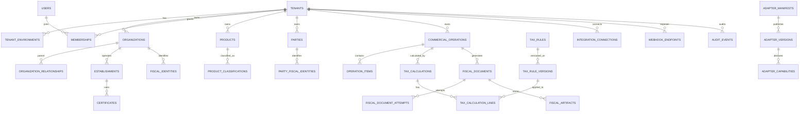

# Modelo relacional e estrategia Supabase

## Objetivo

Projetar o banco antes de qualquer backend. Este documento define schemas, entidades, relacionamentos, constraints, indices, triggers, views e RLS em nivel arquitetural. Migrations reais serao criadas somente na Fase 1.

## Schemas propostos

| Schema | Uso | Exposicao |
| --- | --- | --- |
| `core` | tenants, ambientes, organizacoes, membros, RBAC | privado por padrao |
| `catalog` | produtos, servicos, classificacoes | privado/API controlada |
| `commerce` | pedidos, operacoes, itens, pagamentos | privado/API controlada |
| `tax` | jurisdicoes, regras, versoes, calculos | privado/API controlada |
| `documents` | documentos fiscais abstratos, tentativas, artefatos | privado/API controlada |
| `adapters` | manifestos, versoes, capacidades, execucoes | privado |
| `integrations` | apps, API keys, webhooks, conectores | privado/API controlada |
| `audit` | eventos append-only, evidencias, outbox | privado |
| `ai` | jobs e resultados auxiliares de IA | privado |
| `public` | somente views/funcoes explicitamente seguras | exposto com RLS |

## Diagrama relacional principal



## Tabelas por schema

### `core.tenants`

Campos principais:

- `id uuid pk`
- `slug text unique`
- `legal_name text`
- `display_name text`
- `status text`
- `default_locale text`
- `created_at timestamptz`
- `updated_at timestamptz`

Constraints:

- `slug` unico e imutavel depois da criacao.
- `status` em `active`, `suspended`, `closed`, `trial`.

Indices:

- `unique(slug)`
- `index(status)`

### `core.tenant_environments`

Campos:

- `id uuid pk`
- `tenant_id uuid fk core.tenants`
- `environment_type text`
- `status text`
- `is_default boolean`
- `created_at timestamptz`

Constraints:

- `unique(tenant_id, environment_type)`
- `environment_type` em `sandbox`, `production`, futuramente `homologation`.

### `core.users`

Representa perfil local vinculado ao Supabase Auth.

Campos:

- `id uuid pk`
- `auth_user_id uuid unique`
- `email text`
- `full_name text`
- `status text`
- `created_at timestamptz`

Observacao Supabase:

- Autorizacao nao deve depender de `raw_user_meta_data`, pois e editavel pelo usuario.
- Claims autorizativos devem vir de app metadata ou tabelas internas consultadas por policies/funcoes seguras.

### `core.memberships`

Campos:

- `id uuid pk`
- `tenant_id uuid fk`
- `user_id uuid fk core.users`
- `role_id uuid fk core.roles`
- `scope_type text`
- `scope_id uuid nullable`
- `status text`
- `created_at timestamptz`

Constraints:

- `unique(tenant_id, user_id, role_id, scope_type, scope_id)`
- `scope_type`: tenant, organization, establishment, environment.

### `core.roles`, `core.permissions`, `core.role_permissions`

RBAC inicial com possibilidade de ABAC.

Campos de `core.permissions`:

- `resource text`
- `action text`
- `condition_key text nullable`

Exemplos:

- `documents:create`
- `documents:approve`
- `rules:review`
- `organizations:manage`

### `core.organizations`

Campos:

- `id uuid pk`
- `tenant_id uuid fk`
- `organization_type text`
- `legal_name text`
- `trade_name text`
- `country_of_registration char(2)`
- `status text`
- `metadata jsonb`

Constraints:

- `organization_type`: company, branch, holding, subsidiary, representation, international_company, economic_group.
- `country_of_registration` ISO 3166-1 alpha-2.

### `core.organization_relationships`

Modela matriz, filiais, holding, subsidiarias e grupos economicos.

Campos:

- `id uuid pk`
- `tenant_id uuid fk`
- `parent_organization_id uuid fk`
- `child_organization_id uuid fk`
- `relationship_type text`
- `valid_from date`
- `valid_to date nullable`

Constraints:

- impedir relacionamento de tenants diferentes.
- impedir ciclo por trigger/função na Fase 1.

### `core.establishments`

Campos:

- `id uuid pk`
- `tenant_id uuid fk`
- `organization_id uuid fk`
- `name text`
- `country_code char(2)`
- `jurisdiction_path text[]`
- `address_id uuid`
- `status text`

`jurisdiction_path` representa hierarquia neutra: pais, estado/regiao, county, cidade, distrito quando houver.

### `core.fiscal_identities`

Campos:

- `id uuid pk`
- `tenant_id uuid fk`
- `organization_id uuid fk nullable`
- `establishment_id uuid fk nullable`
- `country_code char(2)`
- `identifier_type text`
- `identifier_value_encrypted text`
- `identifier_value_hash text`
- `valid_from date`
- `valid_to date nullable`
- `status text`

Constraints:

- Pelo menos `organization_id` ou `establishment_id`.
- Valor claro nao deve ser armazenado sem criptografia.
- Hash usado para busca/dedupe sem expor valor.

### `core.certificates`

Campos:

- `id uuid pk`
- `tenant_id uuid fk`
- `environment_id uuid fk`
- `organization_id uuid fk`
- `establishment_id uuid nullable`
- `country_code char(2)`
- `certificate_type text`
- `storage_ref text`
- `fingerprint text`
- `valid_from timestamptz`
- `valid_to timestamptz`
- `status text`

Certificados ficam criptografados em storage seguro, nao em colunas de texto puro.

### `catalog.products`

Campos:

- `id uuid pk`
- `tenant_id uuid fk`
- `product_type text`
- `sku text`
- `name text`
- `description text`
- `unit_code text`
- `status text`
- `metadata jsonb`

`product_type` cobre mercadoria, servico, assinatura, download, kit, combo, marketplace, licenca, SaaS, ativo, aluguel, hospedagem, evento, experiencia, turismo, cosmético, alimento, bebida, artesanato, industria e extensoes.

Indices:

- `unique(tenant_id, sku)` quando `sku` nao nulo.
- `gin(metadata)`.

### `catalog.product_classifications`

Campos:

- `id uuid pk`
- `tenant_id uuid fk`
- `product_id uuid fk`
- `country_code char(2)`
- `classification_system text`
- `classification_code text`
- `valid_from date`
- `valid_to date nullable`
- `source text`
- `status text`

Nao usar nomes locais no Core como regra de negocio. `classification_system` pode conter NCM, HS, UNSPSC, CNAE-like ou outro codigo, mas interpretacao pertence ao adaptador.

### `commerce.parties`

Campos:

- `id uuid pk`
- `tenant_id uuid fk`
- `party_type text`
- `name text`
- `country_code char(2)`
- `default_address_id uuid`
- `status text`
- `metadata jsonb`

### `commerce.commercial_operations`

Campos:

- `id uuid pk`
- `tenant_id uuid fk`
- `environment_id uuid fk`
- `organization_id uuid fk`
- `establishment_id uuid nullable`
- `operation_type text`
- `operation_direction text`
- `origin_country char(2)`
- `destination_country char(2)`
- `currency_code char(3)`
- `operation_date timestamptz`
- `status text`
- `external_reference text nullable`
- `idempotency_key text nullable`

Constraints:

- `unique(tenant_id, environment_id, idempotency_key)` quando chave existir.
- Operacao deve ter itens antes de calculo/emissao definitiva.

### `commerce.operation_items`

Campos:

- `id uuid pk`
- `tenant_id uuid fk`
- `operation_id uuid fk`
- `product_id uuid nullable`
- `service_id uuid nullable`
- `description text`
- `quantity numeric`
- `unit_amount numeric`
- `discount_amount numeric`
- `total_amount numeric`
- `metadata jsonb`

Constraints:

- Quantidade e valores nao negativos, com excecoes modeladas explicitamente.
- Pelo menos produto, servico ou descricao.

### `tax.jurisdictions`

Campos:

- `id uuid pk`
- `country_code char(2)`
- `jurisdiction_type text`
- `parent_id uuid nullable`
- `code text`
- `name text`
- `valid_from date`
- `valid_to date nullable`

Exemplos de `jurisdiction_type`:

- country
- state
- province
- county
- city
- municipality
- tax_zone
- special_region

### `tax.rule_sets`

Campos:

- `id uuid pk`
- `tenant_id uuid nullable`
- `adapter_key text`
- `country_code char(2)`
- `name text`
- `scope text`
- `status text`

`tenant_id` nulo permite regra global/base. Regras tenant-specific podem complementar ou sobrescrever por prioridade, sem alterar historico.

### `tax.tax_rules`

Campos:

- `id uuid pk`
- `rule_set_id uuid fk`
- `adapter_key text`
- `rule_key text`
- `tax_family text`
- `jurisdiction_id uuid nullable`
- `status text`
- `created_at timestamptz`

O Core nao interpreta `tax_family`; ele apenas roteia e audita.

### `tax.tax_rule_versions`

Campos:

- `id uuid pk`
- `tax_rule_id uuid fk`
- `version_number int`
- `effective_from timestamptz`
- `effective_to timestamptz nullable`
- `priority int`
- `conditions jsonb`
- `outcomes jsonb`
- `legal_source_id uuid`
- `workflow_status text`
- `author_user_id uuid`
- `reviewer_user_id uuid nullable`
- `published_at timestamptz nullable`
- `supersedes_version_id uuid nullable`

Constraints:

- `unique(tax_rule_id, version_number)`
- Impedir vigencias conflitantes com mesma prioridade e escopo quando publicado.
- `workflow_status`: draft, in_review, approved, published, retired, rejected.

### `tax.legal_sources`

Campos:

- `id uuid pk`
- `country_code char(2)`
- `jurisdiction_id uuid nullable`
- `source_type text`
- `title text`
- `url text nullable`
- `publication_date date nullable`
- `effective_date date nullable`
- `hash text nullable`
- `notes text`

### `tax.tax_calculations`

Campos:

- `id uuid pk`
- `tenant_id uuid fk`
- `environment_id uuid fk`
- `operation_id uuid fk`
- `adapter_key text`
- `country_code char(2)`
- `calculation_type text`
- `status text`
- `input_snapshot jsonb`
- `result_snapshot jsonb`
- `created_at timestamptz`

### `tax.tax_calculation_lines`

Campos:

- `id uuid pk`
- `calculation_id uuid fk`
- `operation_item_id uuid nullable`
- `tax_rule_version_id uuid nullable`
- `tax_code text`
- `jurisdiction_id uuid nullable`
- `base_amount numeric`
- `rate numeric nullable`
- `tax_amount numeric`
- `evidence jsonb`

O `tax_code` e local ao adaptador. O Core persiste e exibe, mas nao calcula semanticamente.

### `documents.fiscal_documents`

Campos:

- `id uuid pk`
- `tenant_id uuid fk`
- `environment_id uuid fk`
- `operation_id uuid fk nullable`
- `calculation_id uuid fk nullable`
- `adapter_key text`
- `country_code char(2)`
- `document_family text`
- `document_model text`
- `status text`
- `external_reference text nullable`
- `idempotency_key text nullable`
- `created_at timestamptz`
- `updated_at timestamptz`

Statuses:

- draft
- queued
- validating
- signing
- transmitting
- authorized
- rejected
- cancelled
- failed
- archived

### `documents.fiscal_document_attempts`

Campos:

- `id uuid pk`
- `document_id uuid fk`
- `attempt_number int`
- `adapter_version_id uuid nullable`
- `status text`
- `request_snapshot jsonb`
- `response_snapshot jsonb`
- `error_code text nullable`
- `error_message text nullable`
- `started_at timestamptz`
- `finished_at timestamptz nullable`

### `documents.fiscal_artifacts`

Campos:

- `id uuid pk`
- `document_id uuid fk`
- `artifact_type text`
- `storage_provider text`
- `storage_key text`
- `content_type text`
- `sha256 text`
- `size_bytes bigint`
- `created_at timestamptz`

`artifact_type`: xml, pdf, json, qr_code, receipt, signature, evidence_bundle.

### `adapters.adapter_manifests`

Campos:

- `id uuid pk`
- `adapter_key text unique`
- `country_code char(2)`
- `name text`
- `owner text`
- `status text`

### `adapters.adapter_versions`

Campos:

- `id uuid pk`
- `adapter_manifest_id uuid fk`
- `version text`
- `core_contract_version text`
- `status text`
- `published_at timestamptz`
- `deprecated_at timestamptz nullable`

### `adapters.adapter_capabilities`

Campos:

- `id uuid pk`
- `adapter_version_id uuid fk`
- `capability_type text`
- `capability_key text`
- `metadata jsonb`

Exemplos:

- `tax.calculate`
- `document.issue`
- `document.cancel`
- `obligation.generate`
- `government.transmit`

### `integrations.api_keys`

Campos:

- `id uuid pk`
- `tenant_id uuid fk`
- `environment_id uuid fk`
- `name text`
- `key_hash text`
- `prefix text`
- `scopes text[]`
- `status text`
- `last_used_at timestamptz nullable`

Nunca armazenar API key clara.

### `integrations.webhook_endpoints`

Campos:

- `id uuid pk`
- `tenant_id uuid fk`
- `environment_id uuid fk`
- `url text`
- `event_types text[]`
- `secret_ref text`
- `status text`
- `failure_count int`

### `audit.audit_events`

Campos:

- `id uuid pk`
- `tenant_id uuid nullable`
- `environment_id uuid nullable`
- `actor_type text`
- `actor_id uuid nullable`
- `event_type text`
- `resource_type text`
- `resource_id uuid nullable`
- `correlation_id text`
- `causation_id text nullable`
- `request_id text nullable`
- `ip_address inet nullable`
- `user_agent text nullable`
- `before_snapshot jsonb nullable`
- `after_snapshot jsonb nullable`
- `metadata jsonb`
- `created_at timestamptz`

Append-only.

### `audit.outbox_events`

Campos:

- `id uuid pk`
- `tenant_id uuid nullable`
- `environment_id uuid nullable`
- `event_type text`
- `aggregate_type text`
- `aggregate_id uuid`
- `payload jsonb`
- `status text`
- `available_at timestamptz`
- `published_at timestamptz nullable`
- `attempt_count int`

Usado para publicar eventos para filas/webhooks com confiabilidade.

## Relacionamentos obrigatorios

- Toda tabela operacional possui `tenant_id`.
- Toda tabela que depende de ambiente possui `environment_id`.
- Toda FK entre entidades tenant-scoped deve validar que pertencem ao mesmo tenant.
- Adaptadores podem ter schemas proprios, mas devem referenciar entidades globais por IDs e snapshots, nao por acoplamento direto.

## Estrategia RLS

Principios:

- RLS em todas as tabelas expostas via Data API.
- Preferir schemas privados e APIs Workers como gateway principal.
- Policies combinam `TO authenticated` com predicate de membership/tenant; nunca apenas `TO authenticated`.
- UPDATE sempre com `USING` e `WITH CHECK`.
- Views expostas devem usar `security_invoker = true`.
- Funcoes `SECURITY DEFINER` so quando inevitavel, em schema privado, com revogacao de `PUBLIC` e checagem explicita de usuario.

Padrao conceitual:

```text
usuario autenticado -> auth.uid()
auth.uid() -> core.users.auth_user_id
core.users.id -> core.memberships
membership ativo -> tenant permitido + escopo permitido
policy -> tenant_id da linha deve estar nos tenants permitidos
```

## Indices iniciais

Obrigatorios:

- Todas as FKs.
- `(tenant_id, status)` em entidades operacionais.
- `(tenant_id, environment_id, idempotency_key)` em operacoes mutaveis.
- `(tenant_id, external_reference)` para integracoes.
- `(country_code, jurisdiction_type, code)` em jurisdicoes.
- `(tax_rule_id, version_number)` em versoes.
- `(effective_from, effective_to)` em versoes de regra.
- GIN em `conditions`, `outcomes`, `metadata`, `input_snapshot`, `result_snapshot` onde houver consulta.
- `(tenant_id, event_type, created_at desc)` em auditoria.
- `(status, available_at)` em outbox.

## Triggers planejados

- `set_updated_at` para entidades mutaveis.
- `prevent_tenant_mismatch` para FKs tenant-scoped.
- `audit_row_change` para tabelas sensiveis.
- `prevent_rule_version_overwrite` em `tax_rule_versions`.
- `validate_rule_effective_window` para conflitos de vigencia.
- `enqueue_outbox_event` para eventos de dominio.
- `prevent_audit_update_delete` para audit append-only.

## Views planejadas

- `public.current_user_tenants`: tenants acessiveis ao usuario autenticado.
- `public.current_user_permissions`: permissoes efetivas.
- `public.document_status_view`: status operacional de documentos sem segredos.
- `public.tax_rule_current_versions`: versoes publicadas efetivas por data.
- `public.audit_timeline_view`: timeline filtrada por tenant e recurso.

Todas as views publicas devem ser desenhadas para RLS e `security_invoker`.

## Particionamento futuro

Tabelas com potencial de alto volume:

- `audit.audit_events`
- `audit.outbox_events`
- `documents.fiscal_document_attempts`
- `documents.fiscal_artifacts`
- `tax.tax_calculations`
- `tax.tax_calculation_lines`

Estrategia futura:

- particionar por `created_at` e/ou `tenant_id` para auditoria e eventos;
- arquivar artefatos antigos mantendo metadados;
- criar retention por plano e jurisdicao.
