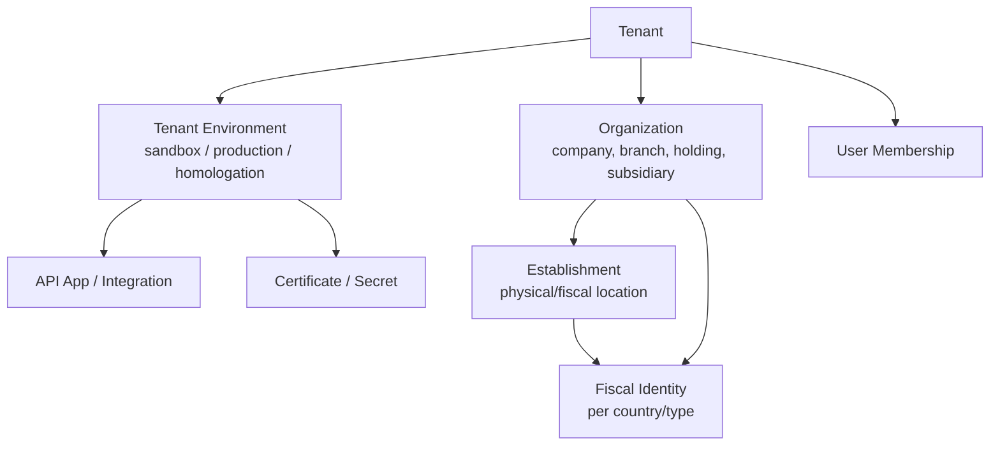

# Estrategia de multi-tenancy

## Modelo escolhido

Modelo inicial: banco compartilhado com isolamento logico forte por `tenant_id`, RLS, RBAC, schemas privados e APIs Workers como camada principal.

Motivo:

- reduz custo e complexidade inicial;
- permite escalar para muitos tenants;
- funciona bem com Supabase PostgreSQL e RLS;
- permite migrar tenants enterprise para isolamento fisico no futuro.

## Unidades de isolamento

## Escopos

| Escopo | Exemplo | Uso |
| --- | --- | --- |
| Tenant | Helvok Tax customer account | billing, quotas, ownership |
| Environment | sandbox, production | segregacao operacional e credenciais |
| Organization | matriz, filial, holding | entidade juridica/fiscal |
| Establishment | loja, CD, escritorio | localidade fiscal |
| Country | BR, PT, US | roteamento de adaptador |
| Jurisdiction | estado, municipio, county | regras fiscais |
| Integration | Shopify, ERP, marketplace | credenciais e rate limit externo |

## Identificadores fiscais

Cada tenant pode possuir varios identificadores:

- CNPJ
- VAT ID
- EIN
- GST/HST/PST/QST
- EORI
- IOSS/OSS
- outros identificadores locais

O Core armazena tipo, pais, valor criptografado, hash e vigencia. O adaptador interpreta sem acoplar o Core ao pais.

## Ambientes

Ambientes iniciais:

- `sandbox`: testes sem valor fiscal real quando o adaptador permitir.
- `production`: emissao real e integracoes oficiais.

Ambiente futuro:

- `homologation`: quando o pais/governo exigir ambiente especifico.

Cada ambiente possui:

- API keys;
- webhooks;
- certificados;
- credenciais governamentais;
- limites;
- configuracoes de adaptador;
- storage namespace/prefix.

## RBAC inicial

Roles sugeridas:

- Owner
- Admin
- Fiscal Manager
- Accountant
- Developer
- Support
- Auditor
- Viewer

Permissoes sao atomicas:

- `tenant.manage`
- `organizations.manage`
- `members.manage`
- `products.manage`
- `operations.create`
- `tax.calculate`
- `rules.create`
- `rules.review`
- `rules.publish`
- `documents.issue`
- `documents.cancel`
- `documents.read`
- `integrations.manage`
- `audit.read`

## ABAC futuro

Condicoes possiveis:

- pais;
- organizacao;
- estabelecimento;
- ambiente;
- tipo de documento;
- valor da operacao;
- status do workflow;
- horario;
- origem da chamada;
- integracao externa.

## RLS

Politica base:

- uma linha tenant-scoped so e visivel se o usuario tem membership ativo no tenant;
- o escopo do membership deve permitir aquele recurso;
- APIs server-side podem usar service role somente em Workers seguros;
- service role nunca vai para frontend;
- policies para `anon` sao proibidas salvo endpoints publicos explicitamente desenhados.

## Enterprise isolation futuro

Quando necessario, um tenant pode migrar para:

- schema dedicado;
- database dedicado;
- projeto Supabase dedicado;
- account Cloudflare dedicado;
- chaves R2/KV/Queue dedicadas.

O dominio e IDs globais devem permitir esta migracao sem alterar APIs publicas.

## Quotas e limites

Quotas por tenant/ambiente:

- requisicoes por minuto;
- calculos por mes;
- documentos emitidos por mes;
- storage R2;
- webhooks ativos;
- adaptadores habilitados;
- usuarios;
- retencao de auditoria.

Rate limit aplicado em:

- Cloudflare Worker;
- API key;
- JWT user;
- tenant;
- endpoint sensivel.
