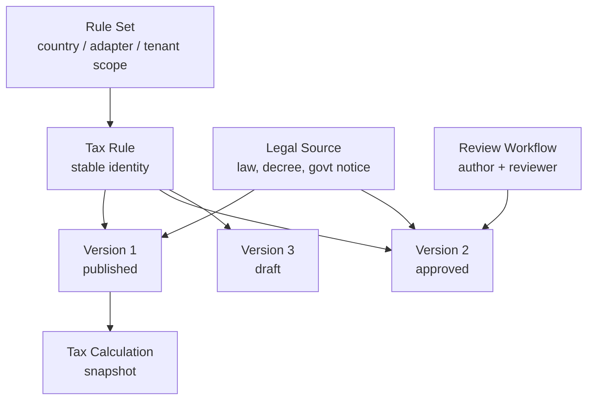
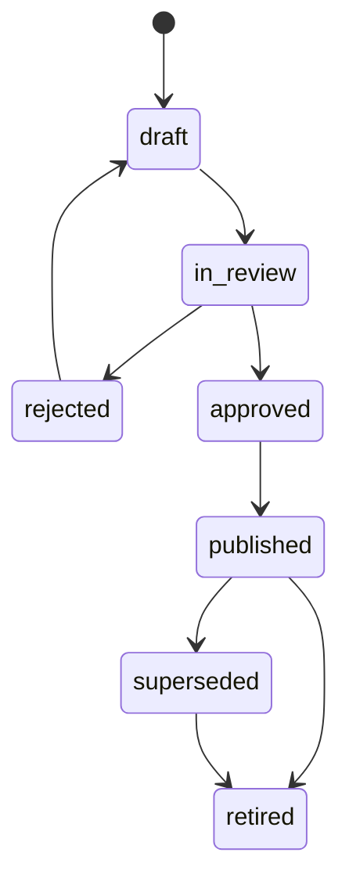

# Versionamento de regras tributarias

## Objetivo

Toda regra tributaria precisa ser historica, auditavel, reproduzivel e rastreavel. Nenhuma regra pode ser sobrescrita. Alteracoes criam novas versoes com vigencia, responsaveis e fonte legal.

## Modelo conceitual

## Estrutura de uma regra

Uma versao de regra possui:

- `country_code`
- `adapter_key`
- `jurisdiction`
- `tax_family`
- `operation_type`
- `product/service conditions`
- `party conditions`
- `organization/establishment conditions`
- `regime`
- `benefit`
- `effective_from`
- `effective_to`
- `priority`
- `conditions`
- `outcomes`
- `legal_source`
- `workflow_status`
- `author`
- `reviewer`
- `published_at`

`conditions` e `outcomes` ficam em formato declarativo. O Core valida formato e ciclo de vida. O adaptador interpreta a semantica local.

## Ciclo de vida

Regras em `draft`, `in_review` ou `rejected` nao podem ser usadas em producao. Podem ser usadas em simulacoes explicitamente marcadas.

## Efetividade

Uma regra e elegivel quando:

- status publicado;
- data da operacao dentro da vigencia;
- jurisdicao corresponde ao contexto;
- prioridade resolve conflitos;
- condicoes batem com contexto fiscal;
- adaptador suporta a versao do contrato.

## Precedencia

Ordem sugerida:

1. Regra tenant-specific.
2. Regra organization-specific.
3. Regra establishment-specific.
4. Regra jurisdicional local.
5. Regra nacional.
6. Regra default do adaptador.

Quando houver conflito, usar:

- maior prioridade;
- maior especificidade de jurisdicao;
- vigencia mais recente;
- desempate explicito configurado no ruleset.

## Snapshots

Todo calculo salva:

- input completo normalizado;
- lista de `tax_rule_version_id` usadas;
- versao do adaptador;
- hash das condicoes/outcomes;
- resultado por linha;
- evidencias e fonte legal;
- correlation_id.

Isso permite reproduzir o calculo mesmo depois de novas leis ou ajustes.

## Homologacao de regras

Antes de publicar:

- validacao de schema;
- revisao humana obrigatoria para regra de producao;
- suite de exemplos;
- simulacao contra casos conhecidos;
- diff contra versao anterior;
- registro de fonte legal;
- aprovacao por role `rules.publish`.

## Retroatividade

Regras podem ter vigencia retroativa, mas nao podem alterar calculos ja emitidos sem criar:

- recalculo controlado;
- evento de auditoria;
- relatorio de impacto;
- workflow de correcao quando o adaptador/documento exigir.

## Tenant overrides

Overrides de tenant devem:

- apontar para regra base quando aplicavel;
- ter justificativa;
- ter aprovacao;
- nunca alterar regra global;
- ser claramente sinalizados no calculo.

## AI e regras

IA pode sugerir revisao, explicar diffs e apontar inconsistencias. IA nao publica regra, nao altera outcome e nao decide imposto.
