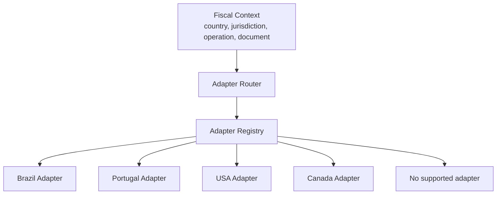

# Estrategia de plugins e adaptadores por pais

## Objetivo

Cada pais deve ser adicionado como plugin/adaptador independente, sem alterar o Core. O Core se comunica por contratos estaveis, versionados e fiscalmente neutros.

## Estrutura conceitual

```text
/adapters
  /brazil
  /portugal
  /germany
  /france
  /italy
  /spain
  /netherlands
  /belgium
  /switzerland
  /uk
  /usa
  /canada
  /mexico
  /argentina
  /chile
  /japan
  /china
  /south_korea
  /singapore
  /india
  /australia
  /new_zealand
  /uae
```

Esta estrutura sera criada em fase de implementacao. Na Fase 0, apenas o contrato e definido.

## Contrato minimo de adaptador

Capacidades:

- `manifest()`
- `validateOperation(context)`
- `classify(context)`
- `calculateTax(context, rules)`
- `prepareDocument(context)`
- `signDocument(context)`
- `transmitDocument(context)`
- `cancelDocument(context)`
- `getDocumentStatus(context)`
- `generateArtifacts(context)`
- `generateObligation(context)`
- `explainRejection(context)`

O Core pode chamar apenas capacidades declaradas no manifesto.

## Manifesto

Campos do manifesto:

- adapter_key
- country_code
- supported_locales
- supported_currencies
- supported_jurisdictions
- supported_document_families
- supported_tax_families
- supported_capabilities
- required_credentials
- required_certificates
- sandbox_support
- government_endpoints
- official_sources
- provider_dependencies
- automation_levels
- contract_version
- adapter_version

## Router de adaptadores



## Brasil

Adaptador inicial, com suporte futuro a:

- NF-e
- NFC-e
- NFS-e
- CT-e
- MDF-e
- SAT
- CF-e
- SPED
- ICMS
- ICMS ST
- IPI
- ISS
- IBS
- CBS
- PIS
- COFINS
- DIFAL
- FCP
- GNRE
- DAR
- EFD
- ECD
- ECF
- obrigacoes estaduais
- obrigacoes municipais

Primeira entrega recomendada: uma familia documental em ambiente de homologacao, com calculo e emissao controlados.

## Europa

Europa nao e um adaptador unico. Cada pais possui modulo proprio:

- Portugal
- Alemanha
- Franca
- Espanha
- Italia
- Holanda
- Belgica
- Suica
- Reino Unido

Capacidades recorrentes:

- VAT
- Excise
- OSS
- IOSS
- EORI
- Intrastat
- Peppol
- eInvoice
- SAF-T quando existir
- idiomas e moedas locais

## Estados Unidos

Adaptador orientado a jurisdicoes:

- Federal
- State
- County
- City
- Special Tax District
- Marketplace Facilitator
- Reseller Certificates
- Nexus
- Economic Nexus
- Use Tax

Deve suportar atualizacoes frequentes e granularidade local.

## Canada

Suporte arquitetural:

- GST
- HST
- PST
- QST
- provincias e territorios

## America Latina

Preparar:

- Mexico
- Chile
- Argentina
- Uruguai
- Colombia
- Peru

## Asia

Preparar:

- Japao
- China
- Coreia
- Singapura
- India
- Tailandia
- Malasia
- Indonesia
- Hong Kong

## Oriente Medio e Africa

Preparar:

- Emirados Arabes
- Arabia Saudita
- Qatar
- Africa em fase posterior

## Isolamento de dados por adaptador

Adaptadores podem ter:

- tabelas proprias em schema `adapter_<country>`;
- migrations proprias;
- jobs proprios;
- configuracoes proprias;
- artefatos proprios.

Mas devem sempre:

- referenciar tenant/environment globais;
- respeitar RBAC/RLS;
- publicar eventos no contrato global;
- manter snapshots de decisao;
- versionar manifestos.

## Conectores governamentais e provedores

Um adaptador pode conter conectores para governos, provedores tributarios, despachantes, contadores, marketplaces e ERPs. Cada conector deve declarar:

- fonte dos dados;
- tipo de credencial exigida;
- se a integracao permite leitura, preparacao, transmissao ou acompanhamento;
- nivel de automacao permitido;
- evidencias que precisam ser arquivadas;
- limites legais ou operacionais conhecidos.

Quando a autoridade nao fornecer API, ou quando a submissao exigir operador local, o adaptador deve operar em modo assistido ou orientacao operacional, mantendo checklist, artefatos e auditoria.

## Marketplace de plugins

Na Fase 10:

- adaptadores podem ser instalados/desinstalados por tenant;
- capacidades podem ser habilitadas por ambiente;
- compatibilidade com Core e verificada por `core_contract_version`;
- cada plugin possui changelog, testes, status e deprecacao.
