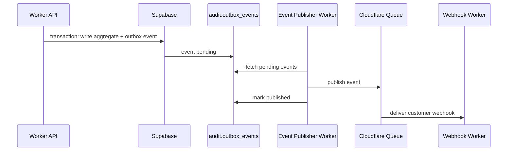

# APIs, eventos e workflows

## API publica

Padrao:

- REST.
- Versionada por URL: `/v1`.
- JSON.
- Idempotencia obrigatoria para operacoes mutaveis.
- OAuth, JWT e API Keys.
- Rate limit por tenant, credencial, endpoint e ambiente.
- Respostas com `request_id`, `correlation_id` e `trace_id`.

## Recursos iniciais

```text
/v1/tenants
/v1/environments
/v1/organizations
/v1/establishments
/v1/fiscal-identities
/v1/products
/v1/services
/v1/parties
/v1/operations
/v1/tax/calculations
/v1/tax/rules
/v1/fiscal-documents
/v1/webhooks
/v1/events
/v1/audit
/v1/adapters
```

## Idempotencia

Toda chamada mutavel aceita:

- header `Idempotency-Key`;
- escopo por tenant + environment + endpoint;
- replay seguro da resposta;
- TTL configuravel;
- conflito quando payload muda para mesma chave.

## Eventos de dominio

Eventos iniciais:

- tenant.created
- organization.created
- product.created
- operation.created
- tax.calculated
- rule.created
- rule.updated
- rule.published
- invoice.created
- invoice.queued
- invoice.authorized
- invoice.rejected
- invoice.cancelled
- guide.generated
- certificate.expired
- integration.connected
- webhook.delivered
- webhook.failed

## Envelope de evento

```json
{
  "id": "evt_...",
  "type": "invoice.authorized",
  "version": "1",
  "tenant_id": "...",
  "environment_id": "...",
  "occurred_at": "2026-07-14T00:00:00Z",
  "correlation_id": "...",
  "causation_id": "...",
  "resource": {
    "type": "fiscal_document",
    "id": "..."
  },
  "payload": {},
  "metadata": {}
}
```

## Outbox



## Workflows

Fluxos longos:

- emissao fiscal;
- cancelamento;
- carta de correcao quando aplicavel;
- envio de obrigacoes;
- conciliacao governamental;
- sincronizacao de marketplace;
- renovacao/alerta de certificado;
- retry de webhooks.

## Workflow de emissao

Etapas:

1. Receber solicitacao e validar idempotencia.
2. Criar documento `queued`.
3. Publicar `invoice.queued`.
4. Workflow valida contexto e adaptador.
5. Adapter classifica e calcula quando necessario.
6. Adapter prepara documento.
7. Adapter assina.
8. Adapter transmite.
9. Persistir recibo, XML, PDF, QR Code e evidencias.
10. Atualizar status final.
11. Publicar evento final.
12. Entregar webhook.

## Webhooks

Requisitos:

- assinatura HMAC;
- secret por tenant/environment;
- retries com backoff;
- logs por tentativa;
- endpoint desabilitado apos falhas recorrentes;
- replay manual;
- versionamento do payload.

## SDK oficial

Entregas:

- TypeScript/Node SDK.
- Cliente REST tipado.
- Helpers de idempotencia.
- Validadores de payload.
- Webhook verifier.
- CLI para operacoes administrativas e testes remotos.

## CLI

Comandos futuros:

- `helvok login`
- `helvok tenants list`
- `helvok rules validate`
- `helvok tax simulate`
- `helvok documents status`
- `helvok webhooks replay`
- `helvok adapters list`

CLI deve operar contra API remota, nao depender de localhost.
