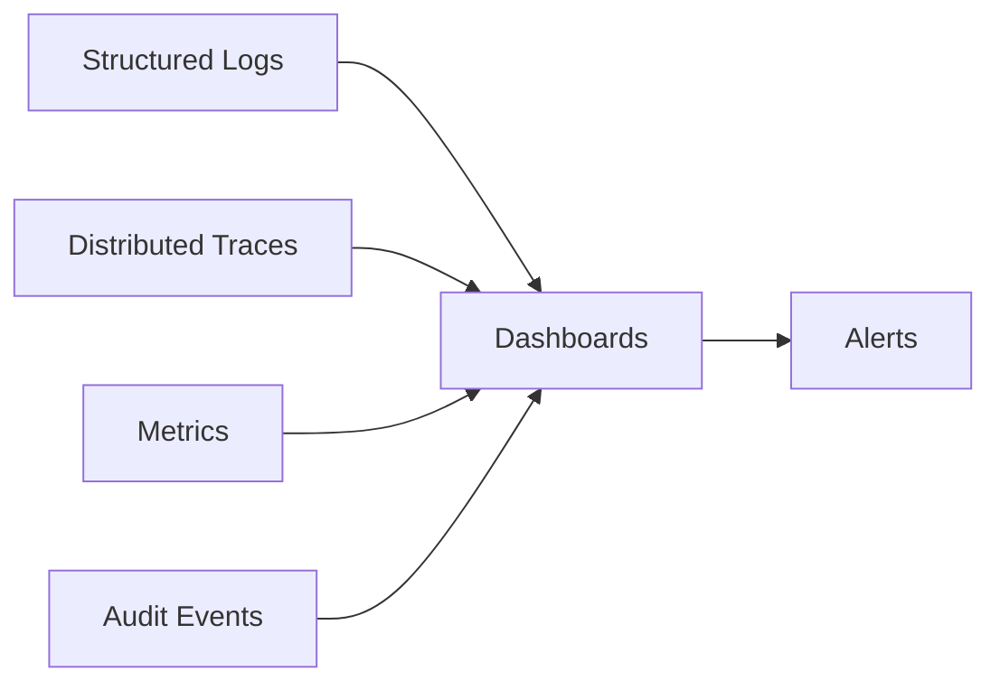

# Seguranca e observabilidade

## Seguranca

### Principios

- Menor privilegio.
- Zero trust entre frontend, API, filas e adaptadores.
- Service role apenas em ambientes server-side controlados.
- Segredos nunca no frontend.
- Auditoria append-only.
- Criptografia em transito e repouso.
- RLS por padrao.
- Separacao de ambientes.
- LGPD e GDPR desde a modelagem.

## Autenticacao

- Supabase Auth para usuarios.
- JWT para sessoes.
- API Keys para integracoes server-to-server.
- OAuth para apps externas quando aplicavel.
- MFA para perfis administrativos e fiscais.

## Autorizacao

- RBAC inicial.
- ABAC progressivo por tenant, pais, organizacao, ambiente, documento e valor.
- Claims sensiveis derivadas de app metadata ou tabelas internas.
- Nunca usar metadata editavel pelo usuario como autorizacao.

## Segredos

Tipos:

- Supabase service role.
- chaves de API externas.
- certificados fiscais.
- senhas de certificados.
- segredos webhook.
- credenciais governamentais.

Regras:

- armazenar em gerenciador de segredos/Cloudflare quando possivel;
- criptografar antes de persistir referencias;
- rotacionar;
- auditar acesso;
- nunca logar valores sensiveis;
- usar hashes para busca/dedupe.

## RLS e banco

Checklist:

- RLS em tabelas expostas.
- Schemas privados por padrao.
- Policies com ownership real.
- UPDATE com `USING` e `WITH CHECK`.
- Views com `security_invoker`.
- Funcoes privilegiadas em schema privado e com `EXECUTE` restrito.
- Auditoria para alteracoes sensiveis.

## Protecao da API

- Rate limit por tenant e credencial.
- Idempotencia contra duplicidade.
- Validacao de payload.
- Limite de tamanho de request.
- Assinatura de webhooks.
- Protecao contra replay.
- CORS restritivo.
- Headers de seguranca.
- WAF/Bot protection quando aplicavel.

## Compliance e privacidade

- Classificacao de dados.
- Retencao por pais e por plano.
- Direito de acesso/exportacao.
- Direito de exclusao quando permitido pela legislacao fiscal.
- Legal hold para documentos obrigatorios.
- Data residency como requisito futuro.
- DPA e subprocessadores documentados.

## Observabilidade

### Objetivos

- Saber se a plataforma esta calculando, emitindo e transmitindo corretamente.
- Rastrear uma operacao do SDK ate o governo.
- Diagnosticar falhas por tenant, adaptador, pais e documento.
- Medir performance, custo e confiabilidade.

## Sinais

## Logs estruturados

Campos obrigatorios:

- timestamp
- level
- service
- environment
- tenant_id
- request_id
- correlation_id
- trace_id
- actor_id
- endpoint/workflow
- adapter_key
- country_code
- document_id
- error_code

PII e segredos devem ser mascarados.

## Traces

Spans principais:

- HTTP request
- auth validation
- RBAC check
- DB query
- rule lookup
- adapter execution
- queue publish
- workflow step
- government request
- R2 write
- webhook delivery

## Metricas

Plataforma:

- request rate
- latency p50/p95/p99
- error rate
- queue depth
- workflow duration
- webhook success rate
- DB latency
- cache hit ratio

Fiscal:

- tax calculations by country
- documents issued by status
- rejection rate by adapter
- authorization time by authority
- expired certificates
- rules published
- rule conflicts detected

Negocio:

- active tenants
- active integrations
- documents per tenant
- storage usage
- API usage per plan

## Alertas

Alertas iniciais:

- API error rate acima do limite.
- fila de emissao acumulando.
- workflow falhando repetidamente.
- aumento anormal de rejeicoes.
- certificado expirando.
- governo indisponivel por adaptador.
- webhooks com falha recorrente.
- RLS/advisor/security issue em Supabase.

## Dashboards

Dashboards iniciais:

- Platform Health.
- Tenant Operations.
- Fiscal Documents.
- Adapter Health.
- Rule Engine.
- Security & Audit.
- Integrations & Webhooks.

## Runbooks

Cada alerta critico deve ter runbook:

- impacto;
- como confirmar;
- comandos seguros;
- rollback;
- comunicacao ao cliente;
- pos-mortem.
