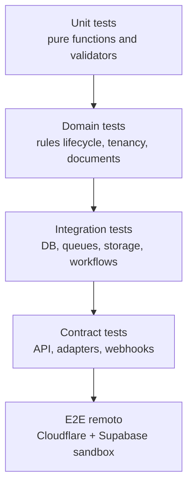

# Plano de testes

## Estrategia

O projeto deve testar contratos, dominio, banco, adaptadores, workflows e seguranca antes de permitir fases de producao. Como o usuario pediu validacao direto na plataforma, testes de integracao e smoke devem rodar contra ambientes Cloudflare/Supabase controlados, sem depender de localhost como fluxo principal.

## Piramide

## Tipos de teste

### Unitarios

- validadores de payload;
- formatadores neutros;
- selecao de adaptador;
- idempotencia;
- permissao efetiva;
- lifecycle de documentos;
- conflitos de vigencia de regra.

### Dominio

- tenant nao acessa dado de outro tenant;
- organizacao/estabelecimento sempre pertencem ao tenant;
- regra publicada nao pode ser alterada;
- draft nao entra em calculo de producao;
- documento autorizado nao volta para draft;
- tentativa rejeitada nao apaga historico.

### Banco e RLS

- RLS bloqueia tenants cruzados.
- UPDATE sem permissao falha.
- Usuario sem membership nao enxerga dados.
- Views respeitam RLS.
- Funcoes privilegiadas nao ficam publicas.
- Audit append-only nao permite update/delete.

### Contratos de API

- OpenAPI como contrato.
- Schemas versionados.
- Testes de backwards compatibility.
- Headers obrigatorios.
- Idempotency replay.
- Rate limit.
- Erros padronizados.

### Contratos de adaptadores

Cada adaptador deve passar em suite comum:

- manifesto valido;
- capabilities declaradas;
- calculo recebe contexto neutro;
- erros padronizados;
- evidencias retornadas;
- documentos geram artefatos;
- transmissao mockada/homologacao quando possivel.

### Workflows e filas

- evento publicado uma vez;
- retries com backoff;
- dead-letter handling;
- workflow resume apos falha;
- cancelamento respeita status;
- webhook replay funciona.

### Seguranca

- API key clara nao armazenada.
- service role nao exposta.
- segredos mascarados em logs.
- CORS restrito.
- HMAC webhook invalido rejeitado.
- payload grande rejeitado.
- dependency audit.

### Performance

- p95 de API publica.
- throughput de calculos.
- tempo medio de autorizacao por adaptador.
- carga de auditoria.
- queries com explain/analyze para regras.
- indices obrigatorios validados.

## Ambientes de teste

| Ambiente | Uso |
| --- | --- |
| local unit | unitarios puros, sem dependencia externa |
| Cloudflare preview | smoke e API remota |
| Supabase sandbox | RLS, migrations, dados seed |
| adapter homologation | comunicacao governamental de teste |
| production | smoke minimo pos-deploy |

## Gate por fase

Fase 1:

- migrations aplicam limpo;
- RLS testado;
- advisors sem erros criticos;
- seeds isolados por tenant;
- backup/rollback documentado.

Fase 2:

- auth/RBAC testado;
- cross-tenant access bloqueado;
- API keys e JWT validados.

Fase 3:

- catalogo e operacoes criam dados consistentes;
- idempotencia em pedidos;
- multi-moeda e multi-pais sem assumptions brasileiras.

Fase 4:

- versionamento de regra;
- conflito de vigencia;
- calculo reproduzivel por snapshot;
- simulacoes separadas de producao.

Fase 5:

- adaptador Brasil em homologacao;
- fila/workflow obrigatorio;
- artefatos em R2;
- rejeicoes preservadas.

## Evidencias de teste

Cada deploy deve registrar:

- commit SHA;
- ambiente;
- suite executada;
- resultado;
- logs/traces relevantes;
- migrations aplicadas;
- versao de adaptadores.
