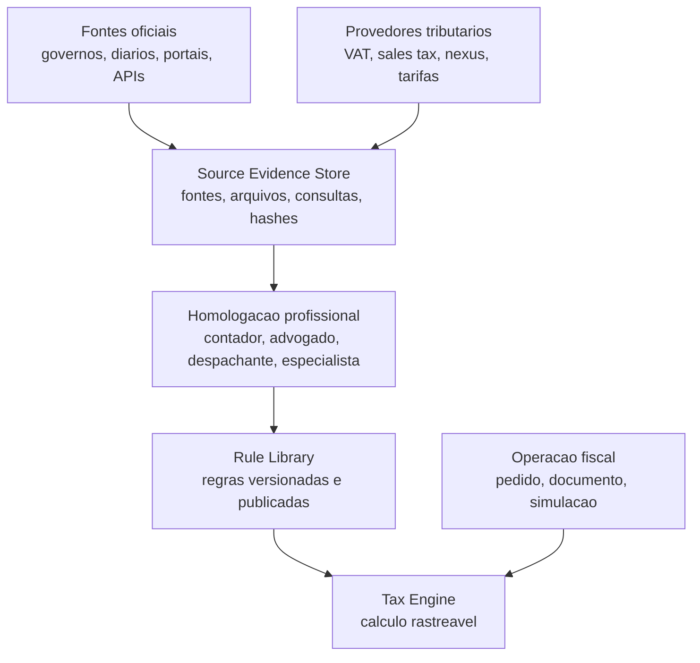
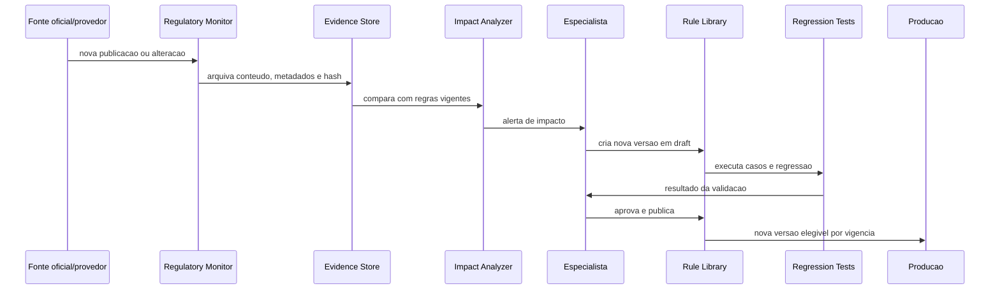

# Regulatory Intelligence

## Objetivo

Helvok Tax pode se conectar a governos, bases oficiais e provedores especializados, mas a plataforma nao deve assumir que conexao equivale a tributacao correta automaticamente.

A promessa responsavel do produto e:

> Dados oficiais monitorados continuamente, regras versionadas, calculos rastreaveis e mudancas criticas sujeitas a homologacao profissional.

Esta camada existe para transformar publicacoes oficiais, dados de provedores e revisoes profissionais em regras fiscais auditaveis, versionadas e seguras para producao.

## Principio central

Calculo fiscal de producao nunca vem diretamente de uma resposta livre, scraping, noticia, PDF, IA ou consulta isolada a provedor externo.

Calculo fiscal de producao vem da combinacao de:

- fonte oficial ou fonte contratual rastreavel;
- dado importado com data, jurisdicao e vigencia;
- regra estruturada;
- versao publicada;
- classificacao fiscal homologada;
- contexto completo da operacao;
- trilha de auditoria.

## Camadas de informacao



## Fontes oficiais

Cada adaptador pode monitorar, importar ou consultar fontes oficiais locais, por exemplo:

- portais de comercio exterior;
- autoridades tributarias;
- diarios oficiais;
- bases tarifarias;
- bases de classificacao fiscal;
- sistemas de documentos eletronicos;
- secretarias estaduais, municipais ou equivalentes;
- comunicados tecnicos;
- manuais operacionais;
- regulamentos e atos normativos.

Essas fontes sao evidencias. Elas nao publicam regras automaticamente em producao.

## Provedores especializados

Helvok Tax pode integrar provedores tributarios para regioes ou problemas especificos:

- aliquotas por endereco;
- VAT;
- sales tax;
- GST;
- nexus;
- economic nexus;
- validacao de IDs fiscais;
- tarifas aduaneiras;
- classificacoes;
- obrigacoes de registro;
- atualizacoes legislativas.

O provedor nunca deve ser fonte unica de decisao critica. Cada dado importante precisa guardar:

- fonte;
- provedor;
- data de consulta;
- jurisdicao;
- vigencia;
- versao;
- fundamento legal quando existir;
- nivel de confianca;
- responsavel pela homologacao;
- payload original ou artefato arquivado.

## Biblioteca de regras homologadas

Fontes oficiais frequentemente entregam dados, nao conclusoes prontas. Uma base tarifaria pode informar medidas aplicaveis a um codigo, mas a classificacao correta do produto ainda pode exigir revisao humana.

Por isso, Helvok Tax mantem uma biblioteca de regras homologadas. Exemplo conceitual:

```text
Regra: EU-IMPORT-SPIRIT-2026-0042
Produto: destilado brasileiro de cana
Classificacao origem: homologada
Classificacao destino: homologada
Origem: Brasil
Destino: Alemanha
Vigencia: 2026-01-01 a 2026-12-31
Tarifa: fonte oficial
Excise: regra nacional homologada
VAT: fonte oficial nacional
Documentos: checklist homologado
Restricoes: bebidas alcoolicas
Status: published
Revisor: especialista aduaneiro
```

Operacoes antigas permanecem ligadas a versao usada no momento do calculo ou emissao.

## Homologacao obrigatoria

Casos abaixo nao devem ser decididos apenas por automacao:

- classificacao aduaneira de produto novo;
- interpretacao de tratado;
- indicacao geografica;
- natureza juridica de kit, combo ou bundle;
- necessidade de licenca sanitaria;
- beneficio tarifario;
- estabelecimento permanente;
- operacao triangular;
- responsabilidade do importador;
- imposto especial ou excise;
- regra local sem fonte estruturada confiavel.

Apos homologada, a regra pode ser aplicada automaticamente a operacoes semelhantes dentro do seu escopo e vigencia.

## Monitoramento continuo



Uma mudanca detectada na internet nao deve ir diretamente para calculo de producao.

## Niveis de automacao

Cada obrigacao, documento ou integracao governamental deve declarar um nivel de automacao.

### Automacao integral

O sistema calcula, transmite, recebe protocolo, arquiva artefatos e publica eventos.

### Automacao assistida

O sistema prepara dados, valida e gera artefatos, mas exige confirmacao, certificado, senha, operador habilitado ou aprovacao profissional.

### Orientacao operacional

O sistema informa procedimento, documentos, orgao responsavel, prazo e evidencias, mas a submissao ocorre fora do Helvok Tax.

Essa classificacao evita prometer uma automacao que a autoridade ou o contexto juridico nao permite.

## IA

IA pode:

- explicar rejeicoes;
- resumir regulamentos;
- comparar versoes;
- traduzir exigencias;
- sugerir documentos ausentes;
- identificar inconsistencias;
- apoiar revisores.

IA nao pode:

- inventar tributacao;
- publicar regra;
- alterar outcome de imposto;
- transmitir documento sem workflow autorizado;
- substituir homologacao profissional em regra critica.

## Produtos internos

Esta arquitetura reforca quatro produtos internos do Helvok Tax:

- Helvok Core: empresas, usuarios, operacoes, documentos, auditoria e eventos.
- Helvok Tax Engine: regras, calculos, simulacoes e snapshots.
- Helvok Regulatory: fontes oficiais, evidencias, alteracoes legais, impacto e homologacao.
- Helvok Connect: governos, provedores, contadores, despachantes, marketplaces e ERPs.

O nome da plataforma permanece Helvok Tax. Estes nomes internos sao boundaries de engenharia e produto.
